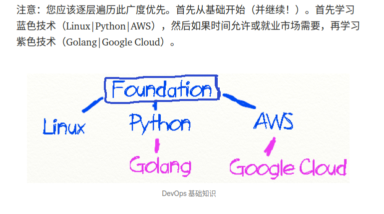
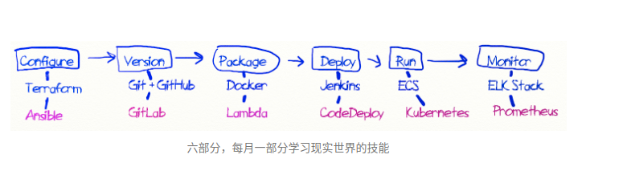
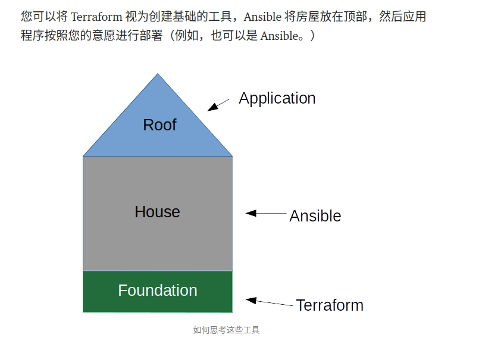
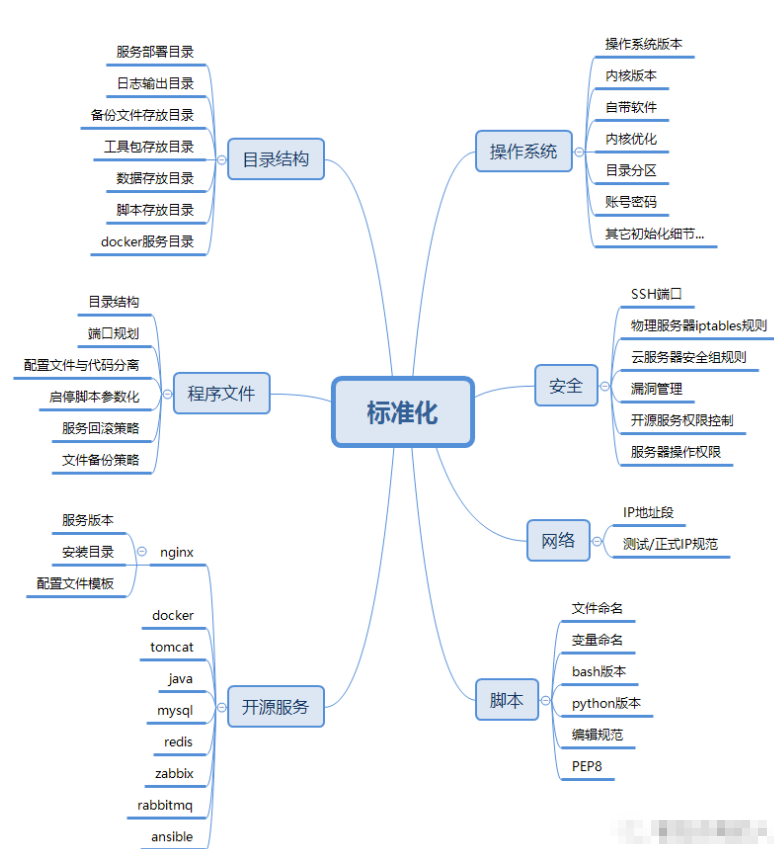

<https://medium.com/@devfire/how-to-become-a-devops-engineer-in-six-months-or-less-366097df7737>

## 基础层
VPC、EC2、IAM、S3、CloudWatch、ELB（在 EC2 保护伞下）和安全组。这些东西足以让你开始，每个现代的、支持云的企业都将大量使用这些工具。
linux、python、aws

## 配置
 Terraform 为未来的代码部署奠定基础。Terraform用来配置基础设施，ansible用来管理配置

代码与配置的解耦非常重要

## 版本
devops的精髓，新方向gitops，AWS Lambda 让您无需预置或管理服务器即可运行代码。您只需为所消耗的计算时间付费——当您的代码未运行时不收取任何费用。

## 打包
docker 容器化，依赖隔离，进程隔离。

## 部署 
jenkins、gitlab-ci、github-action

## 运行
Docker-compose不适用于生产部署，它的目的是本地原型设计或快速功能测试或非常小规模（想想个人家庭）部署。不是产生收入的客户工作负载。生产环境用K8S

## 监控

## 十二要素
<https://12factor.net/>
一、代码库
在修订控制中跟踪一个代码库，许多部署
二、依赖项
显式声明和隔离依赖项
三、配置
在环境中存储配置
四。支持服务
将支持服务视为附加资源
五、构建、发布、运行
严格分离构建和运行阶段
六、流程
将应用程序作为一个或多个无状态进程执行
七。端口绑定
通过端口绑定导出服务
八。并发
通过流程模型向外扩展
九。可处置性
通过快速启动和正常关闭最大限度地提高鲁棒性
X. 开发/产品平价
保持开发、登台和生产尽可能相似
十一。日志
将日志视为事件流
十二。管理流程
将管理/管理任务作为一次性流程运行

基础运维标准化

DevOps形成了十五大类主要工具：编码版本控制、协作开发、构建、持续集成、测试、打包、部署工具、容器、发布、编排、配置管理、监控、警告/分析工具、维护工具、项目管理。

DevOps致力于实现软件产品交付过程中IT工具链打通，使得各个团队减少时间损耗，更加高效地协同工作。

DevSecOps旨在将安全贯穿业务生命周期的每一个环节，在快速交付和灵活相应变化的同时，于不牺牲安全性的前提下，柔和地嵌入到开发流程体系，快速落地和实施安全监控。

具体来看，DevSecOps工具通过安全扫描、报告与分析将帮助开发人员提升代码漏洞的实时洞察力。

企业及组织成功部署DevSecOps有四大最佳实践：在开发人云工作流程和治理流程中嵌入安全工具（自动执行安全漏洞检查，例如静态应用程序安全测试SAST、软件组合分析SCA和动态应用程序安全测试DAST等）、在数据驱动下提升治理流程自动化、提供跨DevOps的端到端可追溯性、支持跨企业协作以解决DevOps管道中的安全问题。